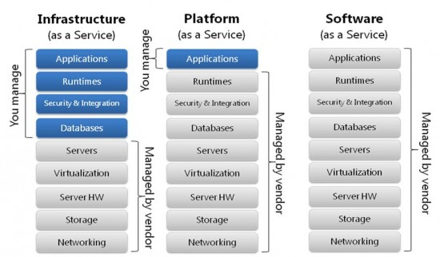

# Introduction to DevOps

DepOps : Praktik dalam sebuah pengembangang Software yang menghubungkan antara tim developer dengan tim Operation (kolaborasi) agar terotomatisasi hinggah tahap rilis ke publik.

## Alur DevOps & Konsep CI/CD

- Alur dimulai dari DevOps membuat rancangan perubahan / update yang akan diserahkan ke Developer (Programmer)
- Developer membuat code
- Developer memberikan code ke DevOps
- DevOps melakukan release. Jika ada masalah maka dikembalikan ke Developer untuk di perbaiki.
- Jika tidak maka DevOps akan melakukan Deployment Aplikasi ke publik.
- Kemudian DevOps memantau/monitoring software

Continuous Integration (CI) : Pengintegrasian kode kedalam repository kode kemudian menjalankannya pengujian secara otomatis.

Continuous Delivery/Deployment (CD) : Praktik yang dilakukan setelah proses CI dan seluruh kode berhasil terintegrasi.

## Virtualization & Container

- Virtualization : suatu metode untuk membuat Virtual Machine untuk menginstal berbagai Operation System dalam suatu hardware dengan spedifikasi yang ditentukan diawal pembuatan.

- Container : Suatu metode untuk membuka berbagai Aplikasi sesuai dengan spesifikasi kebutuhan aplikasi tersebut.

## Cloud Computing

Cloud Computing : metode penyampaian berbagai layanan melalui internet. Seorang DevOps harus paham mengenai Cloud Computing karena  berhubungan dengan penyimpanan secara publik agar bisa diakses oleh user diaman saja dan kapan saja.

Cloud Computing memiliki 3 layanan :

1. IaaS (Infrastructure as a Servive) : layanan cloud yang pada dasarnya server fisik dan virtual server. Penyidia layanan Iaas menyediakan resource cloud seperti server, jaringan, storage dan ruang data center.

2. PaaS (Platform as a Service) : Layanan cloud yang disediakan dalam bentuk platform dan dapat dimanfaatkan pengguna untuk membuat aplikasi diatasnya. PaaS membberikan framework bagi developer yang dapat mereka bangun dan gunakan untuk membuat aplikasi yang telah disesuaikan.

3. SaaS (Software as a Service) : Sebuah perangkat lunak yang dijadikan sebagai layanan yang bersifat online. SaaS ini juga disebut sebagai Layanan Aplikasi Cloud.