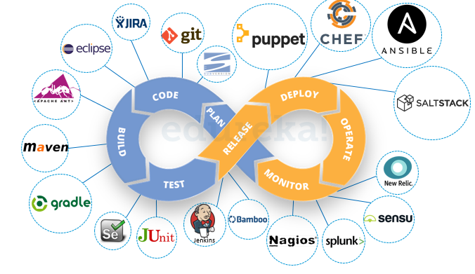

# Introduction to DevOps

DepOps : Praktik dalam sebuah pengembangang Software yang menghubungkan antara tim developer dengan tim Operation (kolaborasi) agar terotomatisasi hinggah tahap rilis ke publik.

## Alur DevOps & Konsep CI/CD

