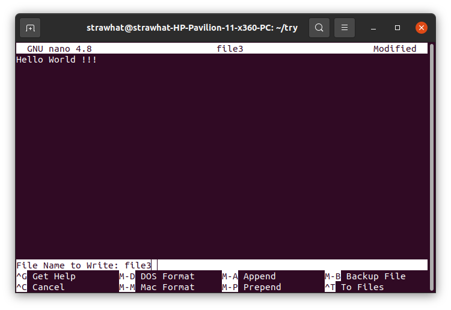
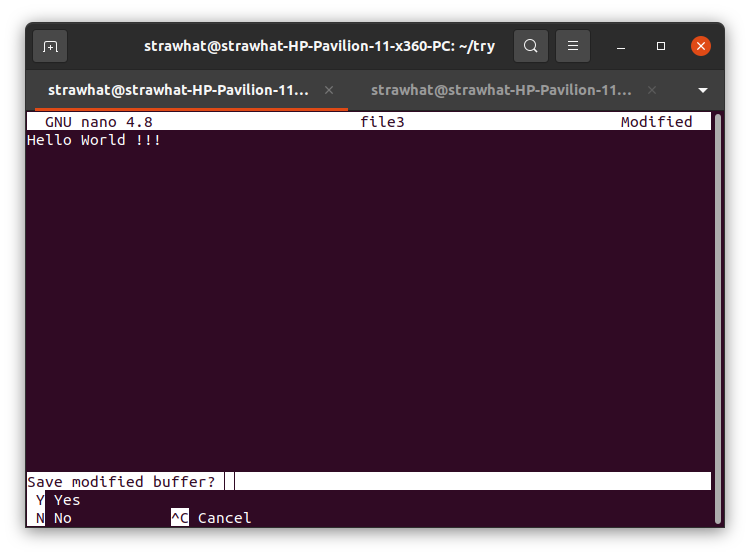
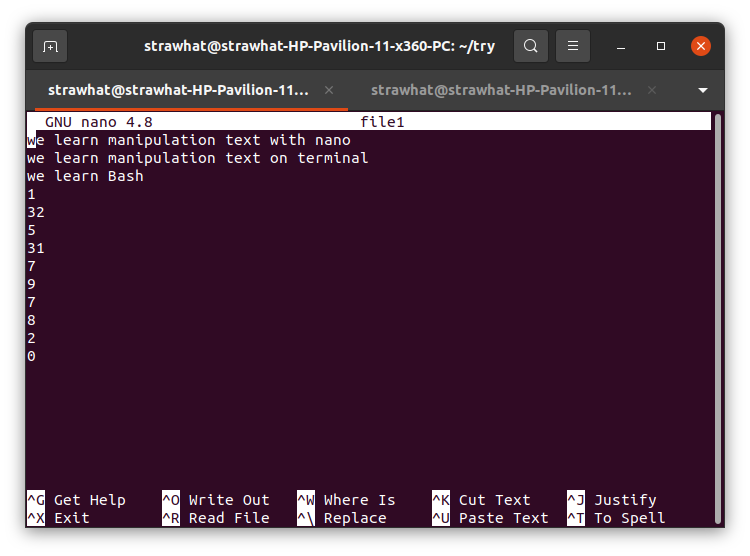
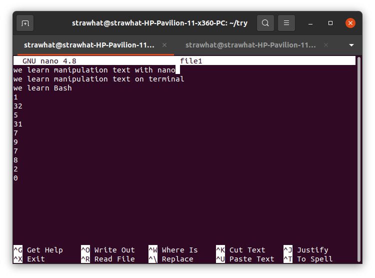
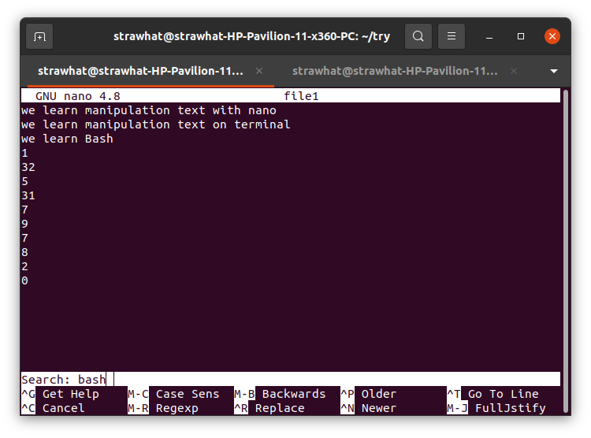
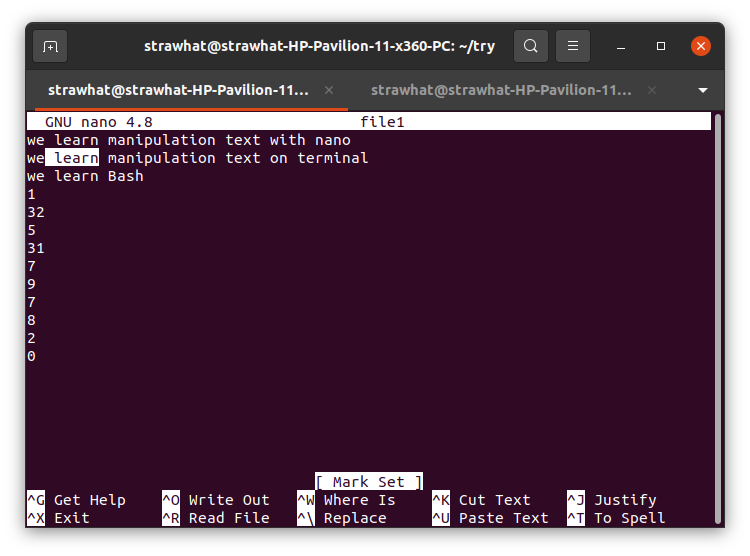
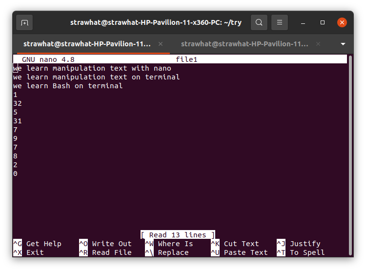
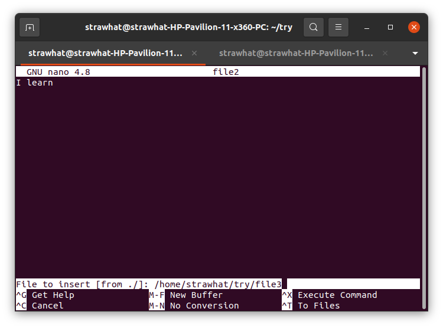
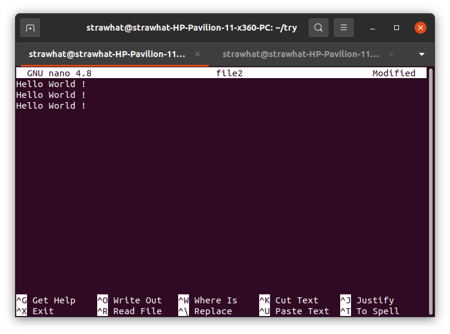
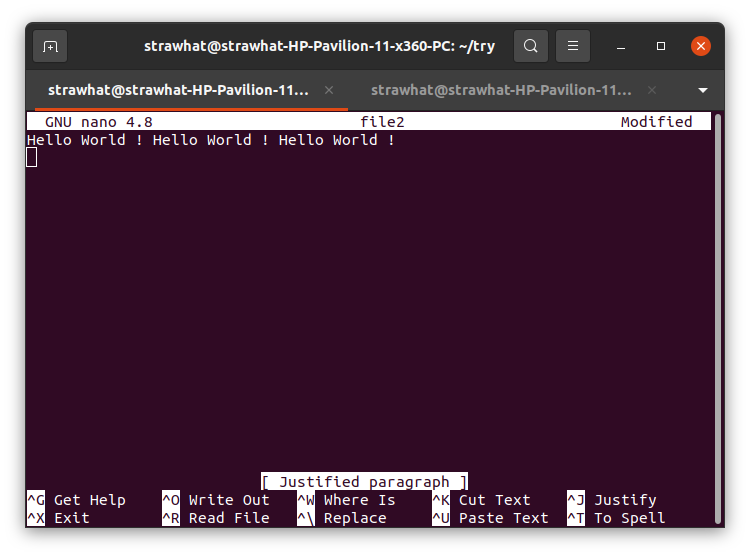

# Text Editor Nano

Teks editor nano : Text editor bawaan/default dari terminal linux. berfungsi untuk memanipulasi teks terminal meskipun tanpa GUI (Graphic User Interface)

## Dokumentasi Shortcut Teks Editor Nano

### Membuka teks editor nano

- `nano`    : Membuka teks editor nano pada terminal linux

### Membuat file sekaligus membuka teks editor nano

- `nano nama-file`  : Membuat file seklaigus membuka teks editor nano. Jika nama file sudah ada maka perintah tersebut hanya untuk memmbuka file dengan menggunakan nano.

### Menangani Updata

- `CTRL + O`    : Menyimpan perubahan file dan tetap membuka teks editor.

- `CTRL + X`    : Keluar dari teks editor dengan tambahan perintah `y` = Menyimpan perubahan, `n` = Tidak menyimpan perubahan, `CTRL + C` = Membatalkan perintah

### Pindah kursor

- `CTRL + A`    : Untuk pindah cursor ke depan suatu baris
- `CTRL + E`    : Untuk pindah cursor ke belakang suatu baris

- `CTRL + W`     : Untuk pindah cursor berasarkan kata yang kita inginkan pindah.

### Manipulasi Teks

- `CTRL + A`    : Untuk memilih teks dengan cara tombol panah kiri/kanan

- `CTRL + K`    : Untuk cut dan copy teks
- `CTRL + U`    : untuk paste teks yang sudah di copy

- `CTRL + R`    : Untuk menyalin isi dari file lain dengan cara memasukan alamat file yang ingin kita salin

- `CTRL + J`    : untuk membuat beberapa baris menjadi satu baris, jika tidak muat maka akan di lanjutkan pada baris selanjutnya.

