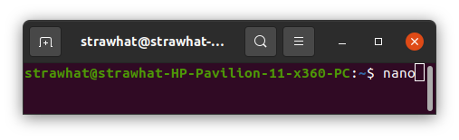
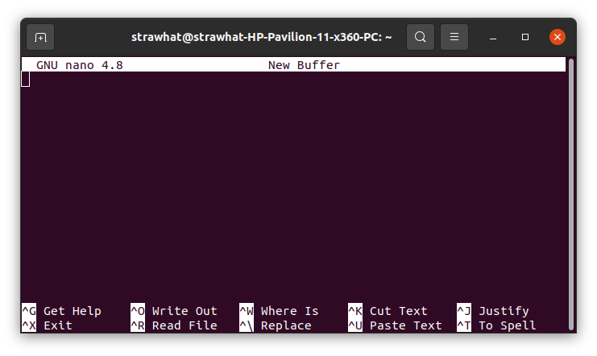
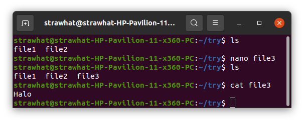
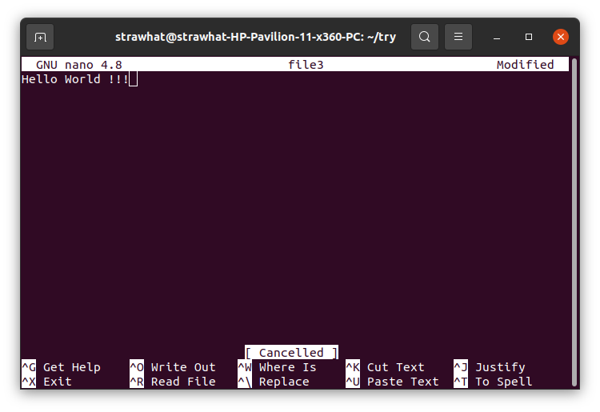

# Text Editor Nano

Teks editor nano : Text editor bawaan/default dari terminal linux. berfungsi untuk memanipulasi teks terminal meskipun tanpa GUI (Graphic User Interface)

## Dokumentasi Shortcut teks editor nano

### Membuka teks editor nano

- `nano`    : Membuka teks editor nano pada terminal linux

### Membuat file sekaligus membuka teks editor nano

- `nano nama-file`  : Membuat file seklaigus membuka teks editor nano. Jika nama file sudah ada maka perintah tersebut hanya untuk memmbuka file dengan menggunakan nano.

