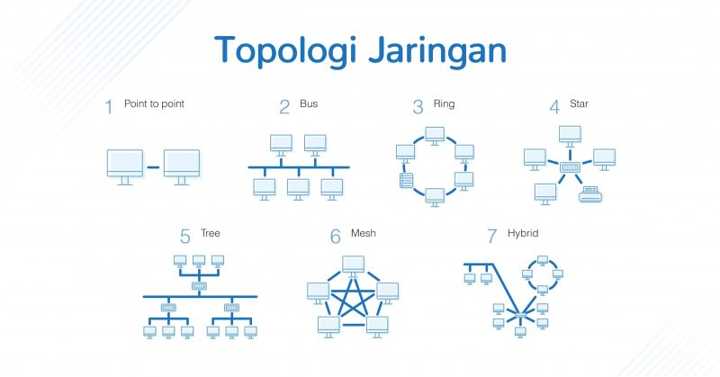

# Topologi & Basic Network

## Basic Network

Network : Hubungan antara 2 atau lebih komputer baik melalui kabel (wire) maupun non-kabel (wireless)

### Tipe Network

- PAN (Personal Area Network) : Jaringan komputer yang dipakai untuk berkomunikasi antara komputer dengan perangkat lain secara langsung. contoh : Komputer ke printer, laptop ke laptop

- LAN (Local Area Network) : Jaringan komputer dengan cakupan wilayah yang kecil seperti jaringan komputer kampus, sekolah, ggedung, jarinagn dalam rumah, kantor dan satu ruangan lainnya. contoh : Internet Rumah, Lab Komputer sekolah, dll.

- MAN (Metropolitan Area Network) : Sebuah jaringan dalam satu kota dengan transfer data kecepatan tinggi yang menjadi penghubung banyak lokasi seperti perkantoran, kampus, pemerintah, dll. Contoh : Jaringan Bank, Perkantoran, antar kampus, dll.

- WAN (Wide Area Network) : Jaringan komputer dengan cakupan area yang sangat besar seperti jaringan komputer antara wilayah, kota dan negara yang butuh router serta saluran komunikasi publik. Contoh : Internet, Satelit.

### Tipe Jaringan Komputer

- Peer to Peer : Model jaringan yang memberikan kedudukan yang sama terhadap komputer, tidak ada yang bertindak sebagai server atau client sehingga tidak ada media penyimpanan yang bersifat umum. Pada model ini dua komputer langsung terhubung tanpatergantung pada server.

- Client -Server : Model jaringan yang memiliki client dan server. Client bertindak sebagai peminta layanan (data atau perangakat keras seperti printer) dan server bertindak untuk melayani permintaan client.

### Topologi Network

- Topology Ring : komputer saling terhubung dengan kembali menghubungkan ke komputer awal. Topogi yang terbilang tidak efisien karena setiap paket yang dikirimkan oleh satu komputer ke komputer lain harus melewati satu titik (komputer) ke titik lainnya agar sampai pada komputer tujuan.

- Topologi Bus : Topologi yang bersifat memberikan station/pemberhentian disetiap kabel yang bercabang. Ketika ada paket data yang mengarah ke suatu tempat , maka setiap komputer akan mendapatkan paket yang dikirimkan. Namun hanya komputer tujuan saja yang akan membalas/reply paket yang dikirimkan.

- Topologi Start : Data yang dikirim dari satu komputer ke komputer lainnya langsung menuju ke lokasi alamat tujuan tanpa harus melewati komputer-komputer yang tidak berkaitan dengan paket yang dikirimkan.

- Topologi Mesh : Topologi yang langsung terhubung antar komputer disetiap link. Sehingga setiap komputer yang menggunakan topologi ini akan memiliki link (jalur) yang lebih cepat untuk sampau di tujuannya.

## IP Address

IP Address : Barisan angka yang dimiliki setiap perangkat yang terhubung dengan internet. Deretan angka angka ini berbeda antar satu perangkat dengan lainnya dan digunakan agar saling terhubung dalam jarinagn internet.

### Versi IP Address :

- IPv4 : Struktur alamat IPv4 memiliki panjang angka 32 bit, yang terdiri dari 4 blok angka yang dipisahkan dengan titik. Setiap blok bisa berisi 1 hinggah 3 digit angka. Masing-masing kumpulan angka tersebut adalah representasi desimal dari 8 bit angka biner. IPv4 menampun 255 alamat. IPv4 memiliki rentang antara 0.0.0.0 hingga 255.255.255.255. Jadi, jika dihitung IPv4 dapat menampung sebanyak 4,3 milliar alamat.

- IPv6 : Struktur IPv6 terdiri dari kombinasi angka dan huruf. IPv6 memiliki panjang angka 128 bit. terdiri dari 8 kelompok angka dan huruf yang setiap kelompoknya dipisahkan dengan titik dua (:).

### Jenis - Jenis IP Address

- IP Public : IP address yang menhubungkan komputer dengan jaringan internet global.

- IP Private : digunakan untuk jaringan lokal atau untuk sistem jaringan lokal (LAN)  seperti pada Lab Komputer, Kantor, Hotel dll.

- IP Dinamis : IP yang berubah sewaktu -waktu yang terjadi karena jumlah IP yang semakin menipis, maka penggunaanyapun bergantian. Jenis IP Dinamis biasanya digunakan untuk umum.

- IP Static : IP yang tidak akan berubah-ubah (tetap). Penggunannya melakukan pemesanan khusus terhadap alamat IP kepada ISP dengan membayar sejumlah biaya. IP Static biasanya digunakan oleh penyedia server, web hosting ataupun lembaga penting yang sangat tergantung pada layanannya.

- Shared IP : Jenis IP yang digunakan oleh beberapa domain/ situs dalam satu server yang sama. Alamat IP ini biasanya di pakai pada layanan shared hosting.

- Dedicated IP : Alamat IP jenis ini hanya memiliki satu domain/situs saja. Dengan menggunakan dedicated IP, reputasi domain pengguna tidak terpengaruh oleh domain lain. Dedicated IP umumnya digunakan oleh pengguna cloud VPS hosting dan pengguna dedicated hosting.